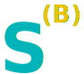
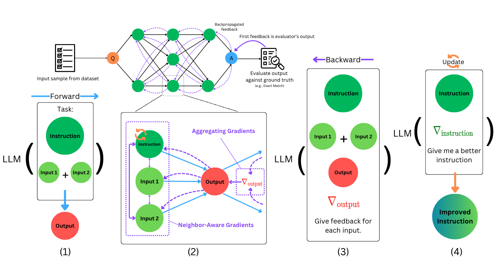

#  How to Correctly do Semantic Backpropagation on Language-based Agentic Systems
</br>

This repository contains the implementation of semantic backpropagation with semantic gradients, a novel method that leverages feedback from the system’s output to improve the optimization of each component within language-based agentic systems.
___



## Abstract
Language-based agentic systems have shown great promise in recent years, transitioning from solving small-scale research problems to being deployed in challenging real-world tasks. However, optimizing these systems often requires substantial manual labor. Recent studies have demonstrated that these systems can be represented as computational graphs, enabling automatic optimization. Despite these advancements, most current efforts in Graph-based Agentic System Optimization (GASO) fail to properly assign feedback to the system’s components given feedback on the system’s output. To address this challenge, we formalize the concept of semantic backpropagation with semantic gradients—a generalization that aligns several key optimization techniques, including reverse-mode automatic differentiation and the more recent TextGrad by exploiting the relationship among nodes with a common successor. This serves as a method for computing directional information about how changes to each component of an agentic system might improve the system’s output. To use these gradients, we propose a method called semantic gradient descent which enables us to solve GASO effectively. Our results on both BIG-Bench Hard and GSM8K show that our approach outperforms existing state-of-the-art methods for solving GASO problems. A detailed ablation study on the LIAR dataset demonstrates the parsimonious nature of our method.

## Project Structure
    /experiments/
    ├── bbh.py           # Evaluation script for BBH
    ├── liar.py          # Evaluation script for Liar
    └── gsm8k.py         # Evaluation script for GSM8K

    /semantic_backprop/
    ├── engine/          # Core implementation
    │   ├── question.py  
    │   ├── statement.py 
    │   ├── instruction.py  
    │   ├── node.py  
    │   └── solutions.py
    ├── llm.py           # LLM querying logic
    ├── prompt_tmp.py    # Prompt templates
    └── utils.py
## Installation
Prerequisites:
- Python 3.10
- pip

To install the package, run:
```bash
pip install -e .
```

## Usage
To run the method on BBH, Liar, and GSM8K, run the following Python scripts like so:
```bash
python experiments/bbh.py --include_grad --full_update --use_bad_samples
python experiments/liar.py --include_grad --full_update --use_bad_samples
python experiments/gsm8k.py --include_grad --full_update --use_bad_samples
```
You can also run the respectively-named bash scripts in the experiments directory to reproduce our experiments in the paper.


### Citation
```bibtex
@misc{wang2024correctlysemanticbackpropagationlanguagebased,
      title={How to Correctly do Semantic Backpropagation on Language-based Agentic Systems}, 
      author={Wenyi Wang and Hisham A. Alyahya and Dylan R. Ashley and Oleg Serikov and Dmitrii Khizbullin and Francesco Faccio and Jürgen Schmidhuber},
      year={2024},
      eprint={2412.03624},
      archivePrefix={arXiv},
      primaryClass={cs.AI},
      url={https://arxiv.org/abs/2412.03624}, 
}
```
